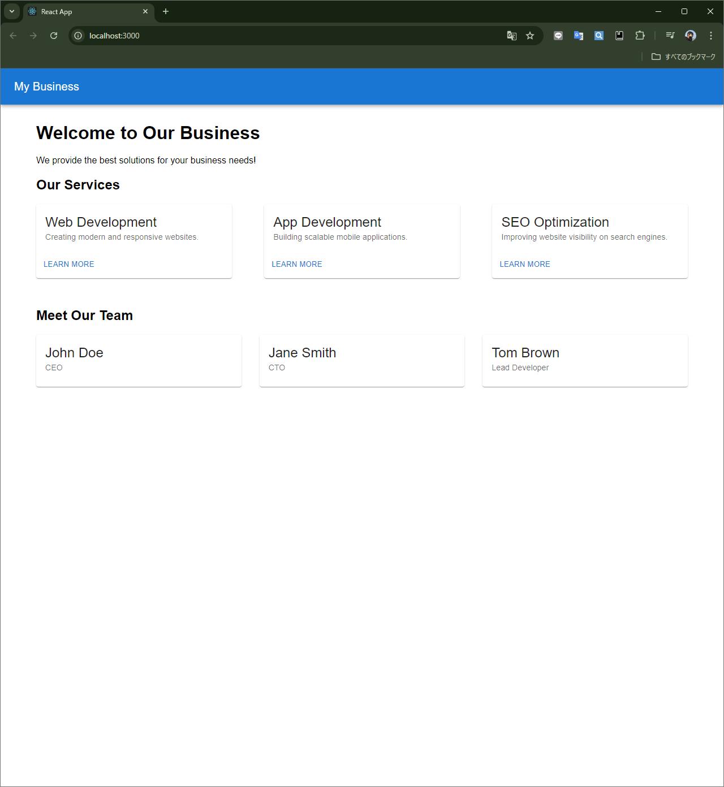

# Template Site - README

## 概要

**Template Site** は、**React**、**TypeScript**、および **Material-UI (MUI)** を使用して作成された、ビジネス紹介ページです。このプロジェクトは、企業やサービスをモダンでレスポンシブなデザインで紹介するために構築されており、シンプルかつ直感的なユーザーインターフェースを提供します。



## 特徴

- **レスポンシブデザイン**：MUIのグリッドシステムを使用して、モバイルデバイスからデスクトップまで幅広いデバイスに対応。
- **簡潔なデザイン**：シンプルでわかりやすいUI。
- **ビジネス紹介セクション**：サービス紹介とチーム紹介。
- **TypeScript** による型安全なコーディング。
- **Atomic Design** に基づくコンポーネント設計。

## プロジェクトのセットアップ

### 必要な環境

プロジェクトを実行するには、以下の環境が必要です：

- Node.js (バージョン 14.x 以上)
- npm (バージョン 6.x 以上) または yarn

### インストール

1. このリポジトリをクローンします：

   ```bash
   git clone https://github.com/your-username/template-site.git
   ```

2. プロジェクトディレクトリに移動します：

   ```bash
   cd template-site
   ```

3. 依存関係をインストールします：

   npmを使用する場合：
   ```bash
   npm install
   ```

   yarnを使用する場合：
   ```bash
   yarn install
   ```

### 開発サーバーの起動

npmを使用する場合：
```bash
npm start
```

yarnを使用する場合：
```bash
yarn start
```

これで、アプリケーションは `http://localhost:3000` で起動します。

### プロダクションビルドの作成

プロダクション向けのビルドを作成するには、以下のコマンドを実行します：

npmを使用する場合：
```bash
npm run build
```

yarnを使用する場合：
```bash
yarn build
```

ビルド成果物は `build/` ディレクトリに生成されます。

## ディレクトリ構成

```bash
/project_root/
├── public/
│   ├── favicon.ico
│   ├── index.html
│   ├── images/
│   │   └── business-intro-screenshot.png
│   └── robots.txt
├── src/
│   ├── components/
│   │   ├── atoms/
│   │   │   ├── Button.tsx
│   │   │   └── Typography.tsx
│   │   ├── molecules/
│   │   │   └── ServiceCard.tsx
│   │   ├── organisms/
│   │   │   ├── Header.tsx
│   │   │   └── BusinessSection.tsx
│   ├── styles/
│   │   └── globalStyles.css
│   ├── utils/
│   │   ├── constants.ts
│   │   └── validation.ts
│   ├── App.tsx
│   ├── index.tsx
│   └── main.tsx
├── README.md
├── tsconfig.json
├── package.json
└── yarn.lock (または package-lock.json)
```

## 主なコンポーネント

1. **`Header.tsx`** - ページ上部に表示されるナビゲーションバー。
2. **`BusinessSection.tsx`** - 会社のサービスを紹介するメインコンテンツ。
3. **`ServiceCard.tsx`** - 各サービスを表示するカードコンポーネント。
4. **`BusinessPage.tsx`** - 全体のビジネス紹介ページ。
5. **`globalStyles.css`** - プロジェクト全体のグローバルなCSSスタイル。

## 使用技術

- **React**：ユーザーインターフェースを構築するJavaScriptライブラリ。
- **TypeScript**：JavaScriptの型付きスーパーセット。
- **Material-UI (MUI)**：GoogleのMaterial Designに基づくUIコンポーネントライブラリ。
- **CSS**：スタイリングとレイアウトのためのカスタムCSS。

## カスタマイズ

### ビジネス情報の変更

ビジネス名、サービス、チームメンバーなどの内容をカスタマイズするには、`src/components` フォルダ内の対応するコンポーネントを編集してください。

- **サービスの変更**：`ServiceCard.tsx` や `BusinessSection.tsx` を編集。
- **チームメンバー**：チーム紹介セクションに必要な情報を追加。

### 新しいコンポーネントの追加

新しいセクションや機能を追加する場合は、**Atomic Design** の原則に従い、適切なフォルダ（atoms, molecules, organismsなど）に新しいコンポーネントを作成してください。

## 今後の改善点

- **コンタクトフォーム**：問い合わせ用のコンタクトフォームを追加。
- **アニメーション**：スムーズなトランジションやアニメーションの追加。
- **SEO最適化**：メタタグやOpenGraphタグを追加してSEOを強化。

## ライセンス

このプロジェクトは [MIT License](LICENSE) の下で公開されています。
